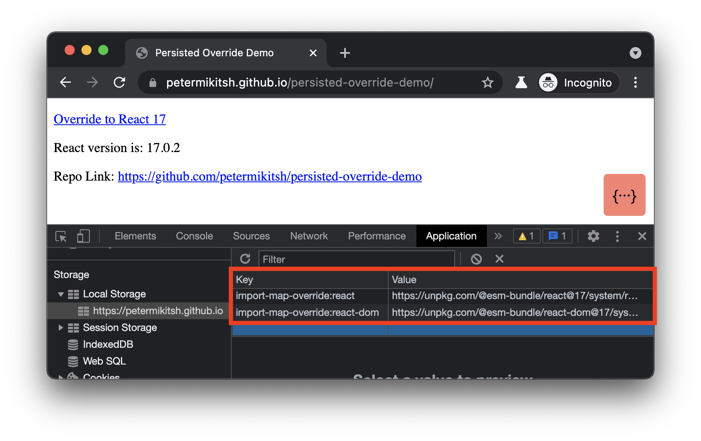

# persisted-override-demo

Writes import maps from a query parameter to local storage.

Demo: https://petermikitsh.github.io/persisted-override-demo/

## Use Case

Generating PR build links to easily inspect a microfrontend in a deployed environment.

> Warning! This could enable bad actors to share a link to your app with their malicious code. Consider applying a Content Security Policy (CSP) or inspect the import URLs to verify the code is trusted.

Pre-requisites:

- You're using [SystemJS](https://github.com/systemjs/systemjs) and [import-map-overrides](https://github.com/joeldenning/import-map-overrides)
- The override modules are built with SystemJS compatibility

### Without Override


### With Override



### Local Development

```
npx http-server .
```
